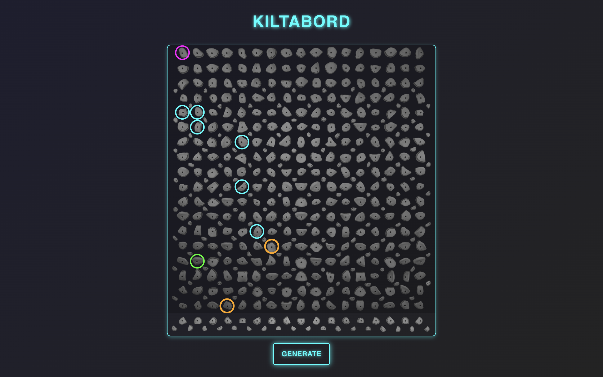

KILTABORD

### What it does
Generate A Climb uses a standard climbing board with an array of holds as well as a algorythmic predicitve model to generate climbs. It does this my randomly generating start holds, and with user input for desired difficulty, it predicts the other holds in the climb based on distance apart and rated difficulty of the hold.

### How we built it
First we tried using a sequential RNN. First we scraped data from a website containing over 20,000 climbs and then created a list of all moves between holds also including the hold type, hold difficulty and climb difficulty that the move was on. We then trained our RNN on this data playing around with hyper parameters to try to improve the learning rate. What we discovered was that likely the data we had was not adequate for a sequential RNN to find legitimate patterns and thus couldn't improve it's loss by any substantial amount.

We then pivoted made a new model which used FNN and MSE for loss. This model instead of predicting next position generated a vector given the previous movement vector, climb difficulty and a matrix of hold weights/difficulty. This problem had the same problem as our last as we quickly found it could not identity relevant patterns to learn.

This led us to our final approach, which was an algorithmic inference model that selects holds based on a weighted difficulty matrix. Instead of relying on deep learning, we used a heuristic approach that evaluates possible hold placements within a defined search radius and selects the next hold by minimizing difficulty while considering movement constraints. This method ensures a predictable yet adaptable route generation process. We then built our React and Vite application, integrating a Flask server to host the API endpoint for our climb generator. This allowed us to dynamically generate and display climbs in real time.

### Challenges we ran into
We ran into several challenges when trying to create generative AI models to analyze the data. We learned that the models that can work with the amount of data provided/quality of data are not sufficient to learn any patterns. This led us to explore other algorithmic ways to generate our climbs.

